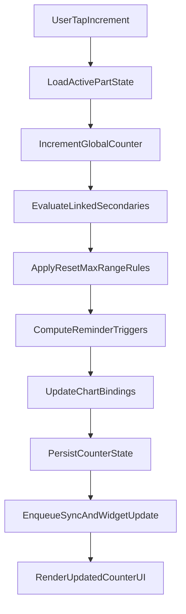
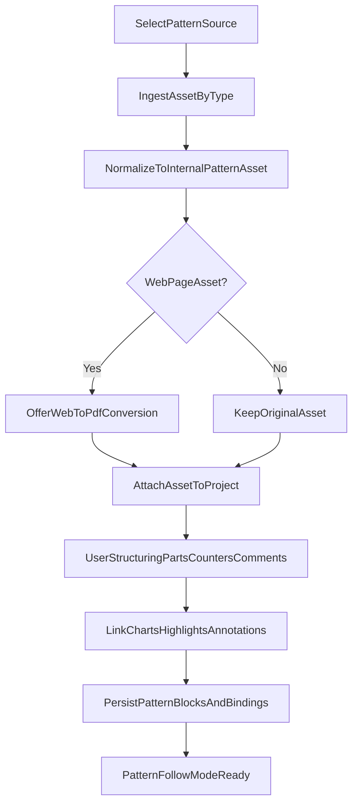

# Row Counter System Research Document

## Scope And Method

This document analyzes how **My Row Counter** appears to implement:

1. Its row counter system
2. Its pattern import/parsing system

Each major claim is labeled as:

- **Confirmed**: explicitly described in public product documentation
- **Inferred**: reasoned implementation hypothesis based on observed behavior and docs

Primary sources:

- [FAQ](https://rowcounterapp.com/faq.html)
- [Counter & Project Features](https://rowcounterapp.com/counter.html)
- [Configure Counters](https://rowcounterapp.com/configure%20counters.html)
- [Help Center](https://rowcounterapp.com/help.html)
- [Pattern Creator FAQ](https://rowcounterapp.com/pattern-creator-faq.html)
- [Other App Features](https://rowcounterapp.com/features.html)

---

## 1) Row Counter System Deep Dive

### 1.1 Core Counter Types

- **Confirmed:** The app distinguishes a **Global Counter** (overall row progression for a part/project) and one or more **Secondary Counters** (sub-cycles such as increases, color changes, repeat blocks).  
  Sources: [FAQ](https://rowcounterapp.com/faq.html), [Counter Features](https://rowcounterapp.com/counter.html), [Configure Counters](https://rowcounterapp.com/configure%20counters.html)
- **Confirmed:** Global counter supports total row target, comments/reminders on specific rows, and average stitches-per-row metadata.  
  Source: [Counter Features](https://rowcounterapp.com/counter.html)
- **Confirmed:** Secondary counters support reset intervals, reset-count display, optional max resets, configurable linkage to global counter, and color/layout options.  
  Source: [Counter Features](https://rowcounterapp.com/counter.html)

### 1.2 Linking Modes And Propagation

- **Confirmed:** Default secondary behavior is one-way link: incrementing global counter increments linked secondary counters.  
  Sources: [FAQ](https://rowcounterapp.com/faq.html), [Counter Features](https://rowcounterapp.com/counter.html), [Configure Counters](https://rowcounterapp.com/configure%20counters.html)
- **Confirmed:** Counters can be unlinked, and a "both ways" mode exists (secondary can drive global increment).  
  Source: [Counter Features](https://rowcounterapp.com/counter.html)
- **Inferred:** Link mode is likely modeled per secondary counter as an enum such as `oneWay`, `bothWays`, `unlinked`, evaluated by a shared increment handler to avoid divergent state logic.

### 1.3 Reset Semantics, Repetition Tracking, And Counter Lifecycle

- **Confirmed:** Secondary counter can reset after row `N`, optionally show reset count (repeat count), and optionally deactivate after max resets.  
  Source: [Counter Features](https://rowcounterapp.com/counter.html)
- **Confirmed:** Counter configuration examples map common pattern structures to reset logic (e.g., repeat every 4 or 5 rows, count repetitions up to fixed count).  
  Source: [Configure Counters](https://rowcounterapp.com/configure%20counters.html)
- **Inferred:** Secondary increment algorithm likely runs in this order:
  1. Increment value
  2. If reaches `resetAfter`, wrap to start value
  3. Increment `resetCount`
  4. If `resetCount >= maxResets`, mark inactive or hidden/deleted per setting

### 1.4 Reminders/Comments Trigger Model

- **Confirmed:** Users can set reminders/comments on specific rows for global and secondary counters.  
  Sources: [FAQ](https://rowcounterapp.com/faq.html), [Counter Features](https://rowcounterapp.com/counter.html)
- **Confirmed:** Comments are commonly used as row-level instruction prompts in sequence setups.  
  Source: [Configure Counters](https://rowcounterapp.com/configure%20counters.html)
- **Inferred:** Reminder display likely uses row-equality matching against active counter value with optional "show once vs persist until dismissed" behavior handled at UI layer.

### 1.5 Project Parts As Counter Namespaces

- **Confirmed:** Projects can contain multiple **Parts** (front, back, sleeve, etc.), each with its own global and secondary counters.  
  Sources: [FAQ](https://rowcounterapp.com/faq.html), [Counter Features](https://rowcounterapp.com/counter.html)
- **Confirmed:** App can auto-switch to next part when current part global counter reaches configured number of rows.  
  Source: [FAQ](https://rowcounterapp.com/faq.html)
- **Confirmed:** Parts can be duplicated in Expert Mode, supporting mirrored piece workflows (e.g., sleeve 1 to sleeve 2).  
  Source: [FAQ](https://rowcounterapp.com/faq.html)
- **Inferred:** Data model likely scopes counters as `Part -> GlobalCounter + [SecondaryCounter...]`, which simplifies switching active views without mixing states.

### 1.6 Expert Mode Implications

- **Confirmed:** Expert Mode exposes advanced options: hide counters, duplicate counters/parts, reorder counters, configure activation ranges, and customize starting values (including 0-based).  
  Sources: [FAQ](https://rowcounterapp.com/faq.html), [Counter Features](https://rowcounterapp.com/counter.html)
- **Confirmed:** Start-at-0 can break chart row alignment assumptions if chart expects row numbering starting at 1.  
  Source: [Counter Features](https://rowcounterapp.com/counter.html)
- **Inferred:** Activation ranges are likely implemented as predicates on global row value (`startRow <= global <= endRow`) evaluated before rendering counter controls.

### 1.7 Chart Highlighter Coupling

- **Confirmed:** Chart highlighters can be linked to global or secondary counters; bars auto-move as counters increment.  
  Source: [Counter Features](https://rowcounterapp.com/counter.html)
- **Confirmed:** Column progression can auto-reset; horizontal bar can auto-disappear at max row.  
  Source: [Counter Features](https://rowcounterapp.com/counter.html)
- **Inferred:** This indicates a generic "counter-bound visual cursor" abstraction where chart overlays subscribe to counter state changes.

### 1.8 Widgets, Lock Screen, And Synchronization Behavior

- **Confirmed:** iOS/Android widgets can control counters and show related info (global, limited secondary, reminders, timer).  
  Source: [Counter Features](https://rowcounterapp.com/counter.html)
- **Confirmed:** Lock-screen/widget interactions may have visible delay and require active internet connection in some cases.  
  Source: [Counter Features](https://rowcounterapp.com/counter.html)
- **Inferred:** Counter actions likely flow through a persistence/sync layer before UI reflects canonical state across app + widgets.

---

## 2) Pattern Parsing / Import System Deep Dive

### 2.1 Supported Input Channels

- **Confirmed:** App supports importing patterns from PDF/ePub/Word, web pages, photo(s), and video pages; includes Ravelry flows in help text.  
  Source: [FAQ](https://rowcounterapp.com/faq.html)
- **Confirmed:** Pattern sources can be added/removed/switched per project from an import overview UI.  
  Source: [Counter Features](https://rowcounterapp.com/counter.html)
- **Confirmed:** Photos can be rotated/cropped; other pattern assets can also be rotated from project overview.  
  Source: [Counter Features](https://rowcounterapp.com/counter.html)

### 2.2 Web Pattern Conversion And Feature Unlocking

- **Confirmed:** Highlighter/annotation tooling works on PDF/images, not raw web pages.
- **Confirmed:** Web-page patterns can be converted to PDF, often removing ads and enabling richer interaction tools.  
  Sources: [FAQ](https://rowcounterapp.com/faq.html), [Counter Features](https://rowcounterapp.com/counter.html)
- **Confirmed:** Users can revert from converted PDF back to original web version.  
  Source: [Counter Features](https://rowcounterapp.com/counter.html)
- **Inferred:** Conversion stage likely normalizes heterogeneous HTML into a static render target so downstream features (highlight, annotation, consistent pagination) run on one format.

### 2.3 Pattern Creator As Structured Parsing/Authoring Counterpart

- **Confirmed:** Pattern Creator supports content blocks (text, row instructions, images, videos, charts), parts, size-specific instructions, and metadata (gauge/material/glossary/techniques).  
  Source: [Pattern Creator FAQ](https://rowcounterapp.com/pattern-creator-faq.html)
- **Confirmed:** Content not placed in a Part may not show counters during follow mode.  
  Source: [Pattern Creator FAQ](https://rowcounterapp.com/pattern-creator-faq.html)
- **Confirmed:** Pattern creators can optionally pre-configure counters/comments per part for consumers.  
  Source: [Pattern Creator FAQ](https://rowcounterapp.com/pattern-creator-faq.html)
- **Inferred:** This implies an internal structured representation where "part + row-aware text blocks + counter presets" acts as a quasi-parsed instruction graph.

### 2.4 Import/Parsing Behavior Boundaries

- **Confirmed:** Public docs focus on import, conversion, segmentation, and interaction, but do not expose a formal NLP/OCR parser specification for arbitrary pattern text.  
  Sources: [FAQ](https://rowcounterapp.com/faq.html), [Counter Features](https://rowcounterapp.com/counter.html)
- **Inferred:** Practical implementation likely emphasizes:
  - format ingestion and normalization
  - user-assisted structuring (parts, comments, counters, chart links)
  - optional creator-authored row semantics
  rather than fully automatic semantic parsing of every freeform pattern source.

---

## 3) Inferred Internal Architecture And Data Model

### 3.1 Candidate Domain Entities

**Inferred model (high confidence):**

- `Project`
- `Part` (belongs to Project)
- `Counter` (global/secondary; belongs to Part)
- `CounterReminder` (belongs to Counter; trigger row/value)
- `PatternAsset` (pdf/web/photo/video/document)
- `PatternBlock` (text/rowInstruction/image/video/chart)
- `ChartBinding` (links overlay cursor to counter id)
- `SyncState` (last synced revision/timestamp/source)

### 3.2 Candidate Counter Schema (Pseudo)

```swift
struct Counter {
    id: UUID
    partId: UUID
    kind: .global | .secondary
    currentValue: Int
    startValue: Int        // 0 or 1
    resetAfter: Int?       // secondary
    resetCount: Int
    maxResets: Int?        // 0/nil => unlimited
    linkMode: .oneWay | .bothWays | .unlinked
    activeRange: ClosedRange<Int>?  // global-row gated
    isHidden: Bool
    isActive: Bool
}
```

### 3.3 Sequence Flow A: Row Increment + Secondary Propagation



### 3.4 Sequence Flow B: Pattern Import + Conversion/Parsing Path



### 3.5 Reliability/Edge Cases To Expect

- **Inferred:** Counter drift risks when start-at-0 and chart rows assume 1-based indexing.
- **Inferred:** Bidirectional linking can create loop hazards unless guarded by reentrancy protection.
- **Inferred:** Multi-surface control (main app, widget, watch) needs conflict resolution strategy (last-write-wins or revision checks).
- **Inferred:** Converting web to PDF improves deterministic rendering but may alter layout and occasionally omit dynamic content.

---

## 4) Practical Takeaways For Product Strategy

### Patterns Worth Borrowing

- **Confirmed+Inferred:** The "global + scoped secondary counters" model maps very well to real knitting/crochet instructions and reduces mental overhead.
- **Confirmed+Inferred:** Part-scoped counter namespaces are a strong abstraction for multi-piece projects.
- **Confirmed+Inferred:** Binding counters to chart/highlighter state provides a cohesive guided-follow experience.
- **Confirmed+Inferred:** Web-to-PDF conversion is a pragmatic normalization step to unlock richer editing interactions.

### Differentiation Opportunities

- **Inferred:** Add explicit "counter templates" per instruction archetype (raglan, lace repeats, shaping blocks) with one-tap setup.
- **Inferred:** Add parser confidence scoring for imported instructions and suggest secondary counters automatically.
- **Inferred:** Add synchronization transparency (revision badges / conflict markers) for widget/watch-heavy workflows.

---

## 5) Source Map With Confidence Labels

| Topic | Confidence | Primary Sources |
|---|---|---|
| Global vs secondary counters | Confirmed | [counter.html](https://rowcounterapp.com/counter.html), [faq.html](https://rowcounterapp.com/faq.html) |
| Link modes and both-ways option | Confirmed | [counter.html](https://rowcounterapp.com/counter.html) |
| Resets, max resets, deactivation | Confirmed | [counter.html](https://rowcounterapp.com/counter.html) |
| Example-driven counter configurations | Confirmed | [configure counters](https://rowcounterapp.com/configure%20counters.html) |
| Parts and per-part counters | Confirmed | [faq.html](https://rowcounterapp.com/faq.html), [counter.html](https://rowcounterapp.com/counter.html) |
| Expert mode range activation/start value | Confirmed | [counter.html](https://rowcounterapp.com/counter.html), [faq.html](https://rowcounterapp.com/faq.html) |
| Chart linking to counters | Confirmed | [counter.html](https://rowcounterapp.com/counter.html) |
| Widget/lock-screen delay behavior | Confirmed | [counter.html](https://rowcounterapp.com/counter.html) |
| Pattern import modalities | Confirmed | [faq.html](https://rowcounterapp.com/faq.html), [counter.html](https://rowcounterapp.com/counter.html) |
| Pattern creator structured model | Confirmed | [pattern-creator-faq.html](https://rowcounterapp.com/pattern-creator-faq.html) |
| Internal data schema and parser pipeline | Inferred | Synthesis from all above sources |

